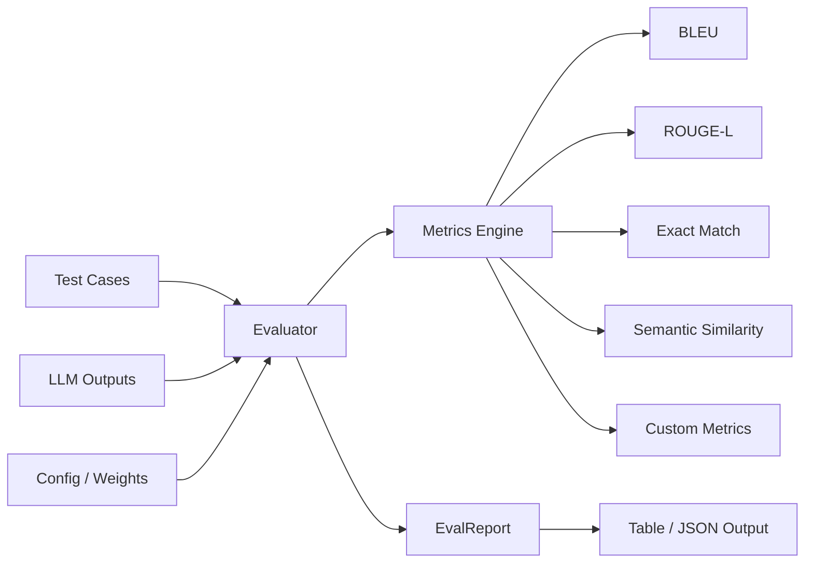

# EvalBench

[](https://github.com/MukundaKatta/EvalBench/actions/workflows/ci.yml)
[](https://www.python.org/downloads/)
[](LICENSE)

**LLM evaluation and benchmarking toolkit** — BLEU, ROUGE, semantic similarity, and custom metrics for benchmarking AI outputs.

## Architecture



## Quickstart

### Install

```bash
pip install -e .
```

### Python API

```python
from evalbench import Evaluator, EvalSuite, TestCase

# Build a test suite
suite = EvalSuite(name="my_eval")
suite.add(TestCase(input="Translate hello to Spanish", expected_output="hola"))
suite.add(TestCase(input="Capital of France?", expected_output="Paris"))

# Your LLM outputs
outputs = ["hola", "Paris"]

# Evaluate
evaluator = Evaluator()
report = evaluator.evaluate_suite(suite, outputs)

print(f"Pass rate: {report.pass_rate:.0%}")
for r in report.results:
    print(f"  {r.test_case.input}: {r.weighted_score:.3f} {'PASS' if r.passed else 'FAIL'}")
```

### Custom Metrics

```python
def word_count_ratio(reference: str, hypothesis: str) -> float:
    ref_len = len(reference.split())
    hyp_len = len(hypothesis.split())
    return min(hyp_len / max(ref_len, 1), 2.0)

evaluator = Evaluator()
evaluator.register_metric("word_count_ratio", word_count_ratio)
```

### CLI

```bash
# Run evaluation
evalbench run suite.json outputs.json --format table

# Create a suite scaffold
evalbench create-suite my_suite.json --name "QA Benchmark"
```

### Suite JSON Format

```json
{
  "name": "qa_benchmark",
  "test_cases": [
    {
      "input": "What is 2+2?",
      "expected_output": "4",
      "tags": ["math"],
      "metadata": {}
    }
  ]
}
```

## Built-in Metrics

| Metric | Description | Range |
|--------|-------------|-------|
| `bleu` | N-gram precision with brevity penalty | 0 – 1 |
| `rouge_l` | LCS-based recall | 0 – 1 |
| `exact_match` | Normalized string equality | 0 or 1 |
| `semantic_similarity` | TF-IDF cosine similarity | 0 – 1 |
| `length_ratio` | Token count ratio (clamped) | 0 – 2 |

## Development

```bash
make dev      # Install dev dependencies
make test     # Run tests
make lint     # Run linter
make format   # Auto-format code
```

## License

MIT — see [LICENSE](LICENSE).

---

Built by [Officethree Technologies](https://officethree.com) | Made with ❤️ and AI
